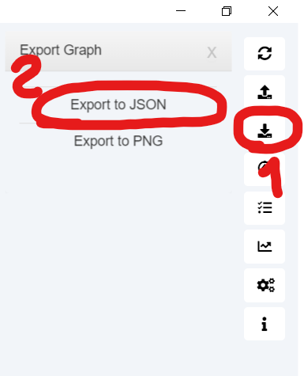

parse_users.py is a small script for parsing json file and output its content to the screen.

1. From your bloodhound instance press export graph button and then Export to json.

2. Copy or move data.json file to the same folder as script.
3. Execute script as follow:

`python3 parse_users.py`

If necessary, redirect output to the file:

`python3 parse_users.py > output.txt`
